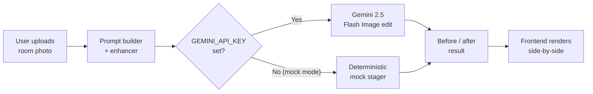

# AI Virtual Staging Studio

> Turn empty or cluttered real-estate photos into professionally staged, market-ready listing images in seconds — powered by Google Gemini 2.5 Flash Image.

[](./LICENSE)
[](https://www.python.org/)
[](https://fastapi.tiangolo.com/)
[](https://vitejs.dev/)

---

## Why this matters / who it's for

Staged homes sell **faster and for more money** — but traditional staging costs thousands of dollars and takes weeks to schedule. Real-estate agents, property managers, and individual sellers routinely pay **$200–$500 per photo** for manual virtual staging turnarounds that take 24–48 hours.

**AI Virtual Staging Studio** collapses that workflow into a single click. Upload a photo of an empty living room or a cluttered bedroom, pick a design style, and get a photorealistic staged version back in seconds — furnished, decluttered, and ready to drop straight into an MLS listing or Airbnb page. It is built for:

- **Real-estate agents** who want listing-ready photos without hiring a staging company.
- **Property sellers & landlords** who need to make a space look lived-in and inviting.
- **Short-term rental hosts** experimenting with different looks before buying furniture.
- **Interior-design and PropTech teams** who want an embeddable staging API.

The result: lower cost, near-instant turnaround, and consistent quality that helps a listing stand out.

---

## Features

- **One-click virtual staging** — upload a room photo, receive a staged, photorealistic result.
- **Style presets** — modern, scandinavian, industrial, mid-century, coastal, and more.
- **Smart prompt builder** — enhances short user instructions into detailed, staging-optimized prompts before they reach the model.
- **Before/after comparison** — original and staged images returned together for an instant side-by-side.
- **Declutter mode** — remove existing furniture and personal items to present a clean, neutral space.
- **Zero-key mock mode** — run the full app end-to-end with deterministic placeholder output and **no API key**, ideal for demos, CI, and local development.
- **Typed, documented API** — FastAPI backend with automatic OpenAPI docs at `/docs`.
- **Modern SPA frontend** — React + TypeScript (strict) + Vite, containerized for easy deploy.

---

## Architecture



**Flow:** the frontend uploads the source image to the backend. The backend builds and enhances a staging prompt from the selected style and instructions, then calls **Google Gemini 2.5 Flash Image** to perform an image-to-image edit. When no API key is configured, a deterministic mock stager returns placeholder output so the entire pipeline still runs. The staged image is returned alongside the original for a before/after view.

---

## Tech Stack

| Layer         | Technology                                                        |
| ------------- | ----------------------------------------------------------------- |
| Frontend      | React, TypeScript (strict), Vite                                  |
| Backend       | Python 3.11, FastAPI, Uvicorn, Pydantic                          |
| AI model      | Google Gemini 2.5 Flash Image (`google-genai` SDK)               |
| Image tooling | Pillow                                                            |
| Packaging     | Docker, Docker Compose, Make                                     |
| Testing       | Pytest (backend), Vitest (frontend)                             |

---

## Quickstart

### Prerequisites

- [Docker](https://www.docker.com/) & Docker Compose (for the containerized path), **or**
- Python 3.11+ and Node.js 20+ (for the local path).

> The app runs out-of-the-box in **mock mode** with no API key. Add a Gemini key only when you want real staged output (see [Adding your API key](#adding-your-api-key)).

### Option A — Docker (recommended)

```bash
# From the repo root
cp backend/.env.example backend/.env   # optional: add GEMINI_API_KEY inside
docker compose up --build
```

- Frontend: http://localhost:4173
- Backend API + docs: http://localhost:8000/docs

### Option B — Local (backend, then frontend)

**1. Backend**

```bash
cd backend
python -m venv .venv
source .venv/bin/activate          # Windows: .venv\Scripts\activate
pip install -r requirements.txt
cp .env.example .env                # optional: add your GEMINI_API_KEY
uvicorn app.main:app --reload --port 8000
```

The API is now live at http://localhost:8000 (interactive docs at `/docs`).

**2. Frontend** (in a second terminal)

```bash
cd frontend
npm install
echo "VITE_API_URL=http://localhost:8000" > .env
npm run dev
```

The app is now live at http://localhost:5173.

> Shortcut: from the repo root, `make install` sets up both, then `make dev-backend` and `make dev-frontend` (in separate terminals) start them.

---

## Adding your API key

The app defaults to **mock mode**. To generate real staged images, provide a Google Gemini API key:

1. Create a key at [Google AI Studio](https://aistudio.google.com/apikey).
2. Add it to `backend/.env`:

   ```env
   GEMINI_API_KEY=your-key-here
   ```

3. Restart the backend.

> **Never commit your key.** Every `.env` file is gitignored. Only `.env.example` (which contains no real secrets) is tracked. In Docker, keys are read from `backend/.env` via `env_file`.

---

## API Reference

Base URL: `http://localhost:8000`

| Method | Endpoint          | Description                                                                 |
| ------ | ----------------- | --------------------------------------------------------------------------- |
| `GET`  | `/api/health`     | Liveness probe. Returns service status and the active provider (`gemini`/`mock`). |
| `GET`  | `/api/modes`      | List available staging modes and design style presets.                      |
| `POST` | `/api/stage`      | Stage a room. Accepts an image + mode/style/instruction, returns before/after. |
| `GET`  | `/docs`           | Interactive OpenAPI (Swagger) documentation.                                |

Example request:

```bash
curl -X POST http://localhost:8000/api/stage \
  -F "image=@living_room.jpg" \
  -F "mode=furnish" \
  -F "style=modern" \
  -F "instruction=add a sofa, coffee table, and warm lighting"
```

> The exact request/response schemas are documented and browsable at `/docs`. Field names are owned by the backend service.

---

## How it works

1. **Upload** — the user selects a room photo and a design style in the frontend.
2. **Prompt build & enhance** — the backend expands the chosen style and free-text instructions into a detailed, staging-optimized prompt (lighting, furniture placement, materials, photorealism constraints).
3. **Model edit** — the enhanced prompt and source image are sent to **Gemini 2.5 Flash Image**, which performs an image-to-image edit to furnish/declutter the space.
4. **Mock fallback** — if no `GEMINI_API_KEY` is set, a deterministic mock stager returns placeholder output so the full pipeline runs without external calls.
5. **Result** — the staged image is returned alongside the original, and the frontend renders a before/after comparison ready for download.

---

## Screenshots

> Drop real screenshots into `docs/screenshots/` and update the links below.

| Before / After | Style picker |
| -------------- | ------------ |
| _`docs/screenshots/before-after.png`_ | _`docs/screenshots/style-picker.png`_ |

_Placeholders — replace with actual product screenshots before sharing this listing._

---

## Roadmap

- [ ] Batch staging (upload multiple photos at once).
- [ ] Furniture "shopping list" with links to purchasable items.
- [ ] User accounts and staged-image history.
- [ ] Additional design styles and per-room presets (kitchen, bathroom, office).
- [ ] Watermark-free high-resolution export tier.
- [ ] Optional inpainting mask for targeted edits.

---

## License

Released under the [MIT License](./LICENSE). Copyright (c) 2026 Eman Munir.
